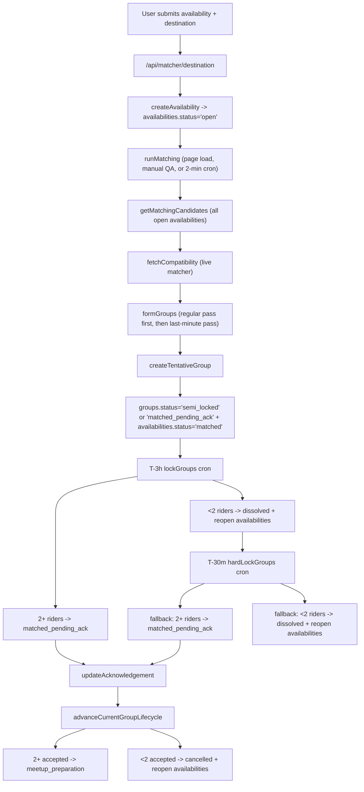

# How Matches Are Generated in Hop

## Big Picture

There are really 3 layers:

1. The web app collects a booking window plus a destination and stores an `open` availability.
2. The matcher scores destination compatibility pairwise.
3. Convex turns those scored riders into groups, then moves those groups through `semi_locked/matched_pending_ack -> meetup_preparation` (or cancellation/dissolve).

## End-To-End

### 1. Destination capture

The availability form does two writes in sequence: first it posts the typed address to `/api/matcher/destination`, then it calls `createAvailability` with the returned `sealedDestinationRef` and `routeDescriptorRef`. The Convex database never gets the plaintext address at this stage.

In **live mode**, the matcher service geocodes the address, generates:

- a `sealedDestinationRef`
- a `routeDescriptorRef`
- encrypted address material kept in the matcher's in-memory store
- geohashes for clustering

That all happens in `submitDestination`.

### 2. Availability creation

`createAvailability` inserts an `availabilities` row with `status: "open"`. Before inserting, it:

- blocks users with unpaid prior rides
- finds that same user's overlapping **open** windows
- marks overlapping old windows as `cancelled`

It does **not** directly trigger matching.

### 3. What actually triggers matching

Matching is kicked off in 3 places:

- the 2-minute cron `runMatchingCron`
- the dashboard page on load
- the group page on load

So any authenticated user opening those pages can trigger a **global** matching pass for everyone, not just themselves.

### 4. Candidate pool

`getMatchingCandidates` simply returns **all** availabilities whose status is `open`, joined with user display names. There is no additional filtering by age, past/future time, or "already in active group" here.

### 5. Compatibility scoring

Convex calls `fetchCompatibility`, which POSTs to `/matcher/compatibility`.

In live mode, the matcher scores every pair of route refs. A pair is discarded if:

- either descriptor is missing
- geohash-6 are not equal/neighbors, and geohash-5 are not equal/neighbors
- straight-line spread is above `MAX_SPREAD_KM` (8 km)
- computed detour is above `MAX_DETOUR_MINUTES` (12 min)

If the matcher is missing route descriptors or OneMap route calls fail, compatibility scoring now fails loudly instead of falling back to synthetic scores. Score is then:

- `0.55 * routeOverlap`
- `0.30 * destinationProximity`
- `0.15 * timeOverlapNorm`

But in the current integration, `timeOverlapNorm` is effectively always `0.5`, because Convex never supplies per-pair overlap to the matcher. So time overlap matters for eligibility later, but not for ranking here.

### 6. Group formation algorithm

`formGroups` is the real grouping algorithm. It is **greedy**, not globally optimal:

- build a compatibility map
- copy all candidates into `unmatched`
- repeatedly try to find the best group of size 4
- if none, try size 3
- if none, try size 2
- once a group is chosen, remove those riders and repeat

A candidate group only survives `evaluateGroup` if:

- every pair has a compatibility edge
- every pair has `detourMinutes <= 12`
- every pair has `spreadDistanceKm <= 8`
- every pair has strictly positive time overlap
- every pair passes gender preference compatibility
- if geohashes exist for everyone, distinct clusters are `<= 3`

Ranking is:

- highest average pair score
- then highest minimum pair score
- then lowest max detour

There is also a small-group release gate:

- pairs and trios are blocked if the shared start time is more than `SMALL_GROUP_RELEASE_HOURS` (36h) away
- 4-person groups are exempt

So the system deliberately waits longer before forming small groups.

### 7. Persisting a tentative group

For each selected group, `createTentativeGroup` re-checks safety before writing:

- no member already belongs to an in-progress group
- every selected availability still exists and is still `open`

If that passes, it:

- inserts a `groups` document with `status: "tentative"`
- patches each chosen availability from `open` to `matched`
- inserts `groupMembers` rows with `accepted: null`, `acknowledgementStatus: "pending"`, `participationStatus: "active"`
- chooses a booker using credibility score
- sends "match found" notifications

This is the write barrier that prevents most duplicate-group races.

### 8. Locking and acknowledgement

Matching can now take two paths:

- if the shared ride window is more than 3 hours away and the group is not full, it starts as `semi_locked`
- if the group is already full, or the shared ride window is within 3 hours, it starts as `matched_pending_ack`
- at T-3h, `lockGroups` finalizes any remaining `semi_locked`/`tentative` group into `matched_pending_ack`
- `hardLockGroups` is now mainly a fallback if something joinable somehow survives past the T-3h lock

So the system prefers "open to joiners" groups first, but last-minute windows go straight into confirmation.

### 9. Acknowledgement resolution

`updateAcknowledgement` only patches the member row. It does not resolve the group on its own.

Resolution happens in `advanceCurrentGroupLifecycle`, which calls `syncLifecycleForGroup`. That function:

- resolves when everyone responded, or the deadline passed, or anyone declined
- if 2+ active members accepted, it removes the non-accepting riders, reopens their availabilities, recomputes booker, and moves the group to `meetup_preparation`
- if fewer than 2 accepted, it cancels the group and reopens everyone's availability

Current UI keeps this alive by polling every 15 seconds on the group page.

## Race Conditions

- **Duplicate matching runs are expected.** `runMatching` can be started by cron and by any user page load. Two runs can read the same open pool, choose the same riders, and race to create the same group. The reason this usually stays safe is that `createTentativeGroup` re-checks both "still open" and "not already in active group"; later writers just return `null`.

- **Acknowledgement deadlines are not enforced by cron.** There is no cron for `matched_pending_ack`. If nobody opens the app, a group can sit past deadline until some page load or poll invokes `advanceCurrentGroupLifecycle`.

- **Page-load order creates a one-cycle lag.** Dashboard/group SSR calls `runMatching` first, then `advanceCurrentGroupLifecycle`. So riders whose availabilities should be reopened by an expired or declined group are not eligible for that same matching pass; they only join the pool on the next one.

- **If the live matcher restarts, old refs can go dead.** The matcher keeps destination/descriptors in a process-global in-memory `Map`. After restart, old `routeDescriptorRef` and `sealedDestinationRef` still exist in Convex but no longer exist in matcher memory, so compatibility scoring silently drops edges and reveal may fail/skip records.

- **Late-join would race badly if it were used heavily.** `attemptLateJoin` checks group size, then patches the group and inserts a member. Two joiners could both see a 3-person group and both try to join. There is no compare-and-swap on membership count.

## Edge Cases And Oddities

- **Semi-locked late join is automatic in matching now.** `runMatching` first tries to place riders into compatible joinable groups using the part of their window that is still outside the 3-hour lock horizon, then falls back to a last-minute-only pass for the sub-3-hour slice.

- **The algorithm is greedy, not optimal.** It always prefers finding a 4-person group before considering any 3- or 2-person partition, even if a different partition would give a better total outcome across the whole pool.

- **Equal-score ties are order-sensitive.** If two candidate groups tie on average score, minimum score, and detour, the earlier combination wins. Since candidates are collected without explicit sort, tie behavior can depend on DB iteration order.

- **Time overlap is a hard gate, not really a score input.** Because Convex never passes `timeOverlapByPair`, the matcher service uses a constant 0.5 overlap factor for every pair. So a pair with 5 minutes overlap and a pair with 90 minutes overlap can rank the same if route geometry is identical, as long as overlap is greater than zero.

- **Zero-minute overlap does not count.** `MIN_TIME_OVERLAP_MINUTES` is `0`, but the code rejects pairs where overlap is `<= 0`. Touching windows like `10:00-11:00` and `11:00-12:00` do not match.

- **Past open availabilities are still matchable.** `getMatchingCandidates` pulls all `open` availabilities, and there is no expiry cleanup for old windows. That means stale open windows can still be considered if they remain in the DB.

- **A user can create a new availability even while already in an active group.** `createAvailability` does not block on active membership. The second group creation is usually stopped later by `createTentativeGroup`'s conflict check, but the extra availability can remain `open` and cause confusing future rematch attempts.

- **Booker selection is inconsistent across stages.** `createTentativeGroup` chooses the booker by credibility score, but `lockGroups` and `hardLockGroups` call `selectBookerUserId` without passing credibility data, which falls back to alphabetical order. Then acknowledgement resolution recomputes by credibility again. So the designated booker can flip during lifecycle without any rider action.

- **Drop-off order is deterministic, not geographic.** `buildLockedGroupDestinations` sorts by opaque `sealedDestinationRef`, so `dropoffOrder` is stable but not a real geographic order.

- **Some status paths look half-legacy.** `locked` is displayed in UI but is not set in the current flow. `group_confirmed` is referenced, but successful acknowledgement currently jumps straight to `meetup_preparation`. `revealed` exists too, but `getActiveTrip` would stop treating that group as active.

## Bottom Line

The current system is not "instant direct rider-to-rider matching." It is:

- create `open` availabilities
- periodically score the whole open pool
- greedily form tentative groups
- freeze those riders by marking availabilities `matched`
- later lock the groups near departure
- only then ask for confirmation
- only on a later lifecycle sync resolve the acknowledgements

So the core safety against races is mostly in `createTentativeGroup`, but a lot of lifecycle timing still depends on page loads and polling rather than autonomous background enforcement.

I also ran the repo tests while tracing this: matching-focused tests and the full suite both passed (`102/102`).
